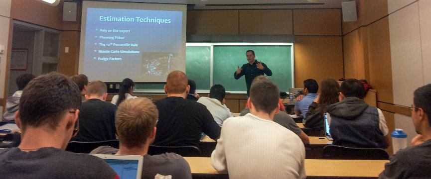
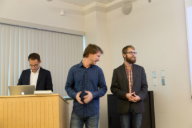
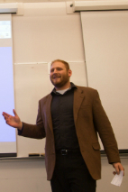
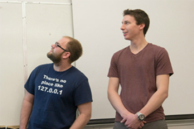
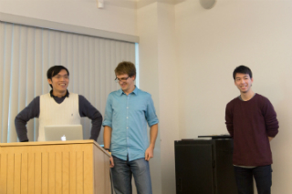
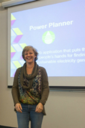
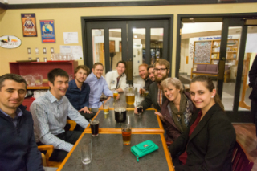
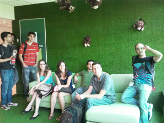
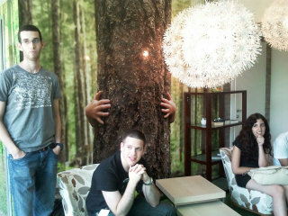
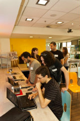

# Testimonials

  

>"I think this is a terrific course, and the students will likely learn more from this than any other undergraduate course they take; and I feel I've learned as much as the students too" - Ian Bull, EclipseSource, 2014/2015 mentor  

>"I saw some of your Tweets the other day and wanted to reach out after far too long to thank you for running Startup Programming back when I was a fourth year at UVic. As I’ve grown in my own career, I look back on Startup Programming as one of (if not the) most impactful class I took throughout my entire Software Engineering degree. It did a wonderful job of capturing the end to end product development process including market research, reaching out to customers to understand their unmet needs, developing prototypical solutions, translating learnings from those prototypes into a prioritized development plan, testing MVPs in the wild, measuring success/iterating on solutions, and taking a product to market. Beyond teaching effective product development skills, it also taught important interpersonal skills such as leveraging the strengths of others to maximize team throughput, running brainstorming/prioritization exercises, communicating effectively with customers, and resolving team conflicts. These are skills I use daily in my work as a Program Manager on the Edge browser team here at Microsoft." Scott Low, Former UVic/Startup Student and Principal Program Manager at Microsoft.

>The startup course at UVic has inspired similar courses at other universities! See this offering at CMU: https://cmu-17-356.github.io/ 

### Students describing the course (2022 Spring semester - University of Victoria)

>The 2022 offering was described in this [UVic News article](https://www.uvic.ca/ecs/info-for/faculty-and-staff/announcements/startup-programming.php)

>"I learned the importance of getting feedback from others and the need to get the app in front of other people as soon as possible as they can easily identify issues or strange user workflows that you may have not found, or initially thought was a good idea but, could be improved upon."
– Sam Kosman, Slacker team

>“Aside from the technical aspect of building an app, I also learned lots about building for the consumer. Looking at a product through the lens of a value proposition was eye-opening.”
– Joe Zlonicky, Decidr team

>“This course was a huge learning opportunity for both technical and soft skills. Even though I worked at a startup company for a year, the experience isn't the same as building an application from scratch with my peers.”
– Cobey Hollier, Tandem team

>“The teaching team and mentors made this the most valuable course I have ever taken and I convinced a few of my friends to take it in the future.”
– Matthew Van Brummelen, SheTrains team

>“Thank you so much for an absolutely wonderful semester and I really hope this class will be offered again at some point! Universities need more courses like this one.”
– Sabrina Korsch, DevXP team

>“I learned a lot while working on this project, possibly the class that I learned the most from during my four years at UVic.”
– Huy Nguyen, StaShare team

### Students describing the course (2014/2015 Fall semester - University of Victoria)
>"Startup Programming is the most applicable and interesting course I have taken at the University of Victoria as it allows students to grow their ideas into projects that have the potential to make a huge impact on real life customers"  

>"I've learned more in start-up class about real life software development than in any other course"

>"A course that aids in the development of real life, practical skills needed to be successful in the software engineering industry"

>"This course will consume your life in a good way"

>"StartUp Programming is an extraordinary experience that will shape you into a better entrepreneur, programmer, and software engineer"

>"The course provided a good insight on how startup companies build a product in 4 months along with getting our own hands dirty into the hard work for building a marketable product in quick time with zero or medium knowledge of technologies!"

>"This course was a great experience, and I really hope that students in upcoming terms have the opportunity to take it"

       

### Students describing the course (2010/2011 and 2011/2012 - Tel Aviv University) 
>"Difficult but interesting, and requires a lot of effort"  

>"The best preparation for the real world, that applies everything we learned"  

>"An opportunity to learn a lot of new technologies and areas, unlike anything else I've done at the university"  

>"Probably the single most significant thing I've done during my degree ..."  

>"The workshop is challenging and requires a looot of time and effort, but is worth the end result, and the knowledge acquired in the process"

  
